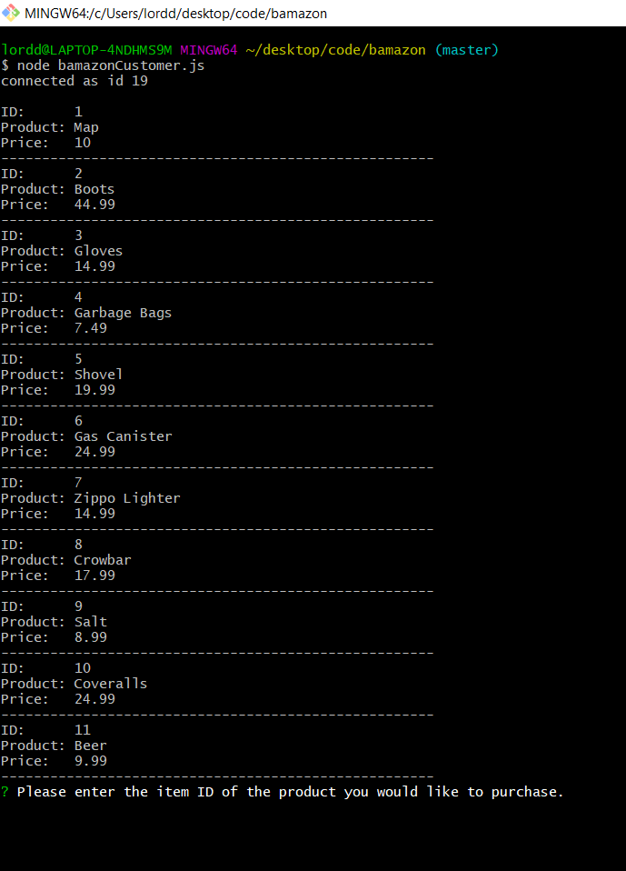
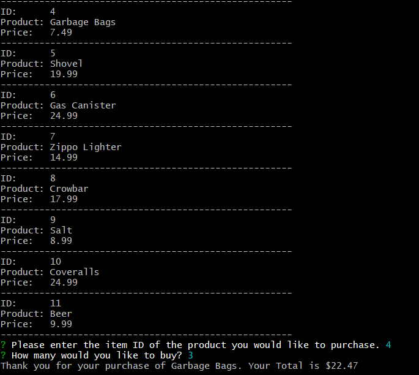

# bamazon
CLI Storefront project for UNCC Coding Bootcamp
The idea of this app is just to build a command line app that will query a sql database to create, read, and update information. 

We start with our customer view where we can view and purchase items for sale

The above image shows the command line opening and displaying the IDs, Names, and price of products for sale.

We then see the user choosing to purchase Garbage bags and being told their total amount based on the quantity of their purchase. 

Since we have altered out database we can take a look at the Manager side to assess our inventory situation. 
Starting with a basic view of the items we have for sale:

Then bringing us back to our prompt screen to see what the manager wishes to do:

The manager decides he wants to see what products they are running a low inventory on:

Where he proceeds to update the quantities:

As you can see the shovel inventory increased by 3 as per his request.

Finally we have given the manager a series of prompts to add new products:

And then the added products:

